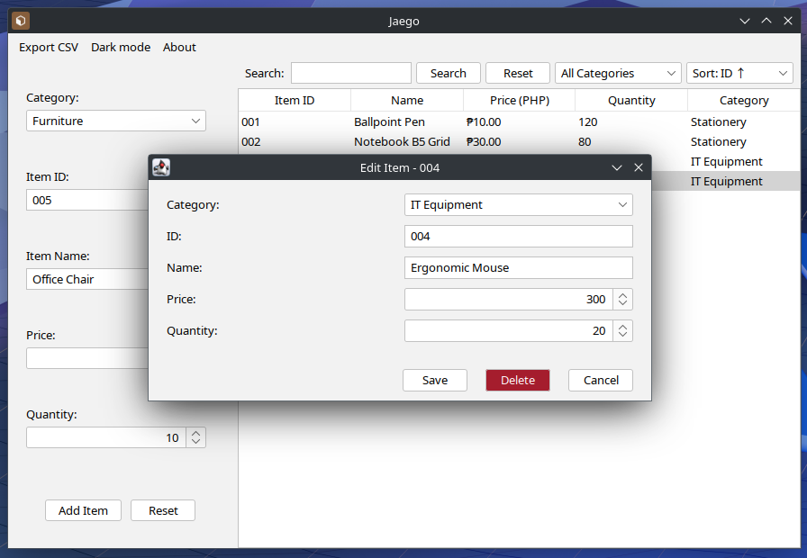

# Jaego

**Jaego** (재고) means "stock" or "inventory" in Korean. 



It is a simple Java Swing program to help manage item inventories. Whether you're organizing office supplies, classroom tools, or personal collections, Jaego offers a clean, intuitive interface with essential features like database persistence, CSV export, and flexible search/filter/sort tools.

## Requirements
- Jaego requires **JDK 17 or higher** to run.
- Building from source also requires Maven and Git.

## Features

- Add new items with ID, name, price, quantity, and category.
- Edit existing items **via double-click** with a user-friendly dialog.
- Persist inventory data using a local `inventory.db` SQLite database.
- Export inventory items to a **CSV file** (via Apache Commons CSV).
- Efficient **search**, **filter**, and **sort** capabilities.
- Displays prices using **locale-aware currency** formatting.


## Running

1. [Download the latest Jaego JAR from the Releases page](https://github.com/nozomi-75/Jaego/releases).
2. Run the application:

    ```sh
    java -jar Jaego.jar
    ```

    Alternatively, you may mark the file as executable and run it as a program.

## Build and Run

1. **Clone the repository:**

    ```sh
    git clone https://github.com/nozomi-75/Jaego.git
    cd Jaego
    ```

2. **Build the project and create the JAR with dependencies using Maven:**

    ```sh
    mvn clean package
    ```

    The JAR file with all dependencies will be generated at `target/Jaego-VERSION-jar-with-dependencies.jar`.
    > Replace "VERSION" with the program version (e.g. 1.2-SNAPSHOT). Refer to `pom.xml` for version details.

3. **Run the generated JAR:**

    ```sh
    java -jar target/Jaego-VERSION-jar-with-dependencies.jar
    ```

## Future enhancements

- Summary statistics (e.g. total inventory value, item counts by category).
- Improved UI and navigation (keyboard shortcuts, better layout, theming).
- Import inventory data from CSV (with auto-mapping and validation).
- Support for multiple currencies or manual currency override.
- Advanced filter options (e.g., quantity range, price range).
- Role-based database schema, access, or user authentication.

## Credits

- [FlatLaf](https://www.formdev.com/flatlaf/) is used for the look and feel of the program.
- [SQLite](https://www.sqlite.org/) is used for a serverless, self-contained SQL database engine.
- [SQLite JDBC Driver](https://github.com/xerial/sqlite-jdbc) is used to access SQLite databases.
- [Apache Commons CSV](https://commons.apache.org/proper/commons-csv/) is used for exporting the item entries.

## License

MIT License. See [LICENSE](LICENSE) for details.

## Made with ❤️ by Zens

- Bryan Suela
- Jan Conrad Maniquiz
- Marco Jaezzy Bacolto
- Sebastian Abad
- Keiaa (nozomi-75)
